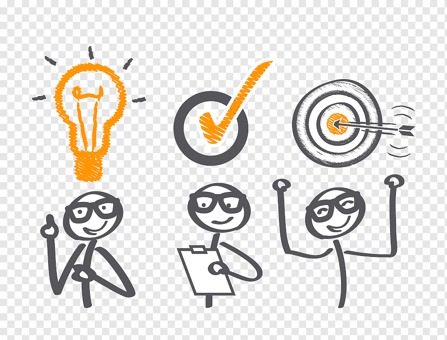
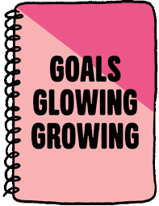
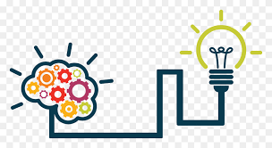

# **Team ADYPU | HackCBS 4.O 💼 Track : Healthcare**

# Problem Statement :

 
  During last 2 years, we have repeatedly felt the critical needed to improve our online infrastructure
  to carry out services like therapy which is predominantly offline in nature, so that it can be comfortably
  accommodated in an online culture. As stress and depression are very serious issues and we have seen a 
  considerable spike in this in this pandemic, it's disputable that online therapies should exist.

 # Objectives : 📔
 
 
 1. To connect patients remotely  with the best doctors of their choice.

 2. To provide immediately essential psychological help and therapy  at the lowest possible cost.

 3. To provide a proper patient  history management system.

 4. To provide one to one video sessions .
 
 5. We give general solutions to general problems which can be read by needed patients and students who are persuing psychology as their majors.  

# Solution : 🔑

  We are trying to provide both patients and the doctors a unified forum to seamlessly conduct therapy sessions remotely.
  Our websites aims at providing efficient management of appoinments and patient reports, in turn helping the doctors to
  fully focus on their profession. on the other hand we provide the clients a one - one stop solutions to handle their 
  reports and medication and reports and easily schedule therapy sessions with doctors form the comfort of their own home.

 # Tech Stack be used :
   
   
   
   
   
   
   

# Team Members - Domains 👨‍👦‍👦

   

1. Rajesh - 2nd Year (B-Tech in Cloud Technology and Information Technology) 

   College : Ajeenkya D.Y. Patil University, School Of Engeering.

   Domain : Web Developer( Front End & Backend )
   
   Past Hackathon Record : Participated in two hackathons                                
2. Ushnish Bhowmik - 1st  Year (B-Tech in Information Technology and Data Science)

   College : Ajeenkya D.Y. Patil University, School Of Engeering.

   Domain : Web Developer( Front End )
   
   Past Hackathon Record : None

3. Mihir JOshi - 1 st Year (BCA in Cloud Technology and Information Technology)

   College : Ajeenkya D.Y. Patil University, School Of Engeering.
  
   Domain : Web Developer( Backend )
   
   Past Hackathon Record : None
   
 4. Bhargav Waghela - 1st Year (B-Tech Cloud Technology and Information Technology )
    
    College : Ajeenkya D.Y. Patil University, School Of Engeering.
  
    Domain : Web Developer( Front End)
    
    Past Hackathon Record : None
  
